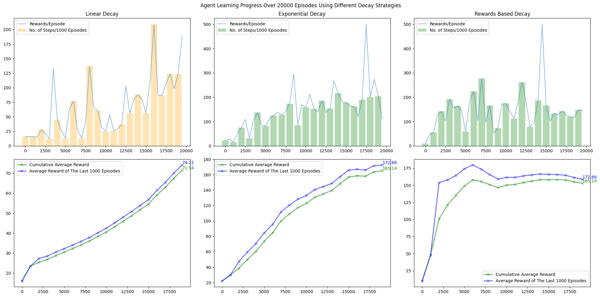
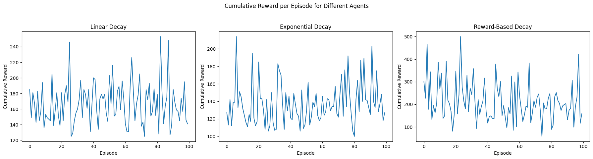

# CartPole-RL-Agent

[](https://www.python.org/)  
[](https://jupyter.org/)  
[](https://gymnasium.farama.org/environments/classic_control/cart_pole/)

A **Reinforcement Learning (RL) agent** developed to balance a pole on a cart using OpenAI Gym's **CartPole-v1** environment. The agent learns to apply forces left or right based on the cart position, velocity, pole angle, and pole angular velocity.

---

## Project Overview

This project explores **Q-learning**, a model-free reinforcement learning algorithm, to train an agent to balance a pole on a cart. The challenge is to keep the pole upright by controlling the movement of the cart along a frictionless track. The project provides in-depth explanations of every step, including environment setup, state discretization, and the Q-learning algorithm.

---

## Key Features

- **Comprehensive Explanation:** Detailed step-by-step guides on every component, including environment setup, variable definitions, Q-table initialization, and epsilon decay strategies.
- **Multiple Epsilon Decay Strategies:** Implements and compares **linear decay**, **exponential decay**, and **reward-based decay** strategies for controlling the exploration-exploitation trade-off.
- **State Space Discretization:** Uses **binning** to convert continuous observation variables (cart position, velocity, pole angle, and angular velocity) into discrete states suitable for Q-learning.
- **Q-learning Algorithm:** Implements the Q-learning algorithm to train an agent to balance the pole, updating Q-values based on the reward and state-action values.
- **Agent Evaluation:** Evaluates the agent's performance over **100 episodes** and compares cumulative rewards for each decay strategy.
- **Episode Rendering:** Renders a full episode of the agent's behavior and displays it as a **video** within the notebook.
- **Educational References:** Links to tutorials and articles explaining Q-learning and reinforcement learning concepts.

---

## Technologies Used

- **Python 3.x**
- **Jupyter Notebook**
- **OpenAI Gym** (`gymnasium`)
- **NumPy** for data manipulation
- **Matplotlib** for plotting results

---

## Setup & Installation

1. **Clone the repository:**
   ```bash
   git clone https://github.com/<your-username>/CartPole-RL-Agent.git
   ```

2. **Run the notebook:**
   ```bash
   jupyter notebook CartPole_RL_Agent.ipynb
   ```

4. **Follow the notebook** to train the agent, evaluate its performance, and visualize its behavior.

---

## Task Breakdown

### **Task 1: Development of the RL Agent**
- **Q-learning Implementation:** Explains the use of the Q-learning algorithm to train the agent.
- **State Space Discretization:** Converts continuous state variables into discrete values using **binning**.
- **Q-table Initialization:** The Q-table is initialized with random values to encourage exploration in the early stages.
- **Epsilon Decay:** Implements **three epsilon decay strategies** (linear, exponential, and reward-based) to control the agent's exploration rate.

### **Task 2: Evaluating the Agent**
- The agent is evaluated using the **100 episodes** criterion to track its cumulative reward.
- Performance is compared for each decay strategy, and the strategy yielding the highest cumulative reward is selected.

### **Task 3: Rendering and Demonstrating Policy**
- **Video Rendering:** The agent’s actions are rendered in real-time, and a video is displayed within the notebook.

---

## Training the Agent with Different Epsilon Decay Strategies

The agent is trained using three different **epsilon decay strategies** to compare their performance in terms of:
- **Linear Decay:** A steady reduction in exploration over episodes.
- **Exponential Decay:** A faster reduction of exploration initially, slowing down as the agent learns.
- **Reward-Based Decay:** Exploration is reduced based on the agent’s performance (i.e., when it reaches a reward target).

---

## Evaluation Results

- The **reward-based decay** strategy produced the highest average cumulative reward, with the agent surpassing the target reward of **195** in some runs.
- **Exponential decay** resulted in faster learning but higher variability in rewards.
- **Linear decay** offered stable but slower improvements over episodes.
#### Agent Learning Progress Over 20000 Episodes



---

## Plotting Results

Performance for each epsilon decay strategy is visualized using **Matplotlib**, showing:
- **Cumulative reward per episode** for different strategies.
- **Average reward over episodes** to assess the learning rate and stability.
#### Cumulative Reward per Episode for Different Agents (Different Decays)



---

## Project Structure

```
CartPole-RL-Agent/
│
├─ CartPole_RL_Agent.ipynb   # Main notebook with code and explanations
├─ README.md                 # Project description and instructions
├─ images/                        # Folder for storing images
│   ├─ agent_learning_progress.png
│   └─ cumulative_reward_per_episode.png
└─ video/                    # Folder for saving rendered videos of agent performance (to be added)
```

---

## References

- **Q-Learning Algorithm:** [What Is Q-Learning?](https://www.simplilearn.com/tutorials/machine-learning-tutorial/what-is-q-learning)
- **Q-Learning Implementation:** [Q-Learning Algorithm: From Explanation to Implementation](https://medium.com/data-science/q-learning-algorithm-from-explanation-to-implementation-cdbeda2ea187)
- **Epsilon Decay Strategies:** [Reward-Based Epsilon Decay](https://aakash94.github.io/Reward-Based-Epsilon-Decay/)
- **OpenAI Gym:** [CartPole-v1 Environment](https://gymnasium.farama.org/environments/classic_control/cart_pole/)
- **Q-learning for CartPole:** [Using Q-Learning for OpenAI’s CartPole-v1](https://medium.com/swlh/using-q-learning-for-openais-cartpole-v1-4a216ef237df)

